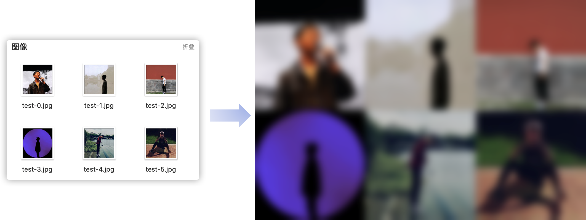

# 照片墙

[中文(zh-cn)](https://github.com/doubleZ0108/Art-of-Photo-Wall-Gallery/blob/master/README.md) | [English(en)](https://github.com/doubleZ0108/Art-of-Photo-Wall-Gallery/blob/master/README_en.md)

* [写在前面](#写在前面)
* [如何运行](#如何运行)
* [环境配置](#环境配置)
* [TODOs](#todos)
* [关于作者](#关于作者)

------

## 写在前面

🎂21岁生日的时候在想该怎么用一张图回顾我的20岁

📅20岁这年，开始用日历记录每天的日程

🎁于是想到将这一年每一周的日历拼起来留作纪念，但无奈没找到合适的工具，就在2021.01.08的凌晨开始送自己这个特殊的礼物。

📸照片墙的背景是这一年日历的拼接图虚化；左下角放的是生成这张图片的python代码；文字是用Procreate在照片上手写的  希望能好好珍藏每一个阶段独特的回忆，希望你也能开始用特殊的方式记录生活


<br/>

## 如何运行

1. 安装所需要依赖 `pip intall -r requirements.txt`

2. 将所有原始图片放入`img/`文件夹中

3. 执行`src/generate.py`脚本，参数：

   - `-s` `--size`：统一调整原始图片为该尺寸(默认为400*400)  [🌰 --size 400 300]
   - `-b` `--blur`：高斯模糊等级(0~10，默认为6)  [🌰 --blur 4]

   ```bash
   python src/generate.py		        # 默认参数生成照片墙
   python src/generate.py -s 300 300	# 照片墙中每个照片尺寸为300*300
   python src/generate.py -b 10	        # 照片墙虚化等级为10
   python src/generate.py --size 400 300 --blur 4
   ```

4. 结果图片将保存为`img/result/result.png`

   > 【效果展示】
   >
   > 

<br/>

## 环境配置

- **操作系统**：macOS Catalina 10.15.7
- **python环境**：Python 3.7.4
- **主要依赖**：numpy\==1.18.1, opencv_python\==3.4.2.16, Pillow==8.1.0

```bash
.
├── README.md
├── img			# original image
│   ├── result		# result image
│   │   └── result.png
│   ├── test-0.jpg
│   ├── test-1.jpg
│   ├── ...
├── requirements.txt
└── src
    ├── generate.py	# main function for generate
    └── util.py
```

<br>

## TODOs

- [x] 照片墙拼接生成
- [x] 照片墙虚化(高斯模糊)
- [ ] 不推荐原始照片总数为质数
- [ ] 暂未考虑原始照片尺寸不同时的畸变问题

<br/>

## 关于作者

| 姓名 \| Name👤       | 张喆 \| doubleZ                                     |
| ------------------- | --------------------------------------------------- |
| 学校 \| University🏫 | 同济大学 \| Tongji Univ.                            |
| 联系方式 \| Email✉️  | [dbzdbz@tongji.edu.cn](mailto:dbzdbz@tongji.edu.cn) |
